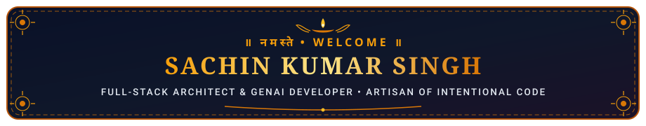
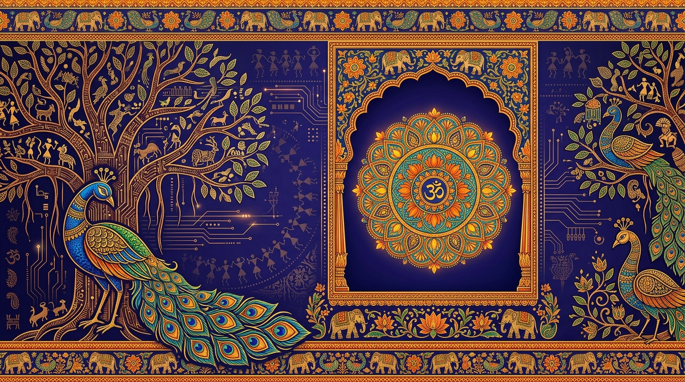

<div align="center">

  <!-- Static Indian Ornate Namaste Header -->
  

  <br/><br/>

  <!-- Static Indian Folk Art & Tech Illustration Hero Banner -->
  

  <br/><br/>

  <!-- Traditional Indian Mandala SVG Section Divider -->
  

  <br/>

  <!-- Social Badges in Indian Pigment Palette (Saffron, Terracotta, Indigo & Emerald) -->
  <p align="center">
    <a href="https://linkedin.com/in/sachin-kumar-singh-6a8431228" target="_blank">
      
    </a>
    <a href="mailto:sachinsingh13112004@gmail.com">
      
    </a>
    <a href="https://x.com/SachinSing75233" target="_blank">
      
    </a>
    <a href="https://behance.net/sachinkumars9" target="_blank">
      
    </a>
    <a href="https://instagram.com/sachinnxiii" target="_blank">
      
    </a>
  </p>

</div>

<br/>

## 🪷 ॥ तत्त्वज्ञानम् • Philosophy & Artisan Identity ॥

```artisan-tablet
┌──[ SACHIN KUMAR SINGH • CRAFTSMAN'S TABLET ]─────────────────────────────┐
│                                                                          │
│  विद्या ददाति विनयं विनयाद्याति पात्रताम् ।                                   │
│  पात्रत्वाद्धनमाप्नोति धनाद्धर्मं ततः सुखम् ॥                                 │
│  "Knowledge bestows humility; from humility comes true capability."      │
│                                                                          │
│  • IDENTITY      :: Computer Science & Engineering Scholar               │
│  • CRAFT FOCUS   :: Full-Stack Web Architecture, Applied GenAI & Systems │
│  • WORK ETHIC    :: Building with intentionality, resilience & empathy   │
│  • HERITAGE      :: Rooted in India 🇮🇳 • Architecting for the World       │
└──────────────────────────────────────────────────────────────────────────┘
```

<br/>

<!-- Static Warli Folk Art Strip Divider -->
<div align="center">
  
</div>

<br/>

## 🎨 ॥ कौशल्यम् • Tech Matrix & Tool Ecosystem ॥

<p align="center">
  
</p>

<table width="100%">
  <thead>
    <tr>
      <th align="left" width="30%">🏛️ Domain</th>
      <th align="left" width="70%">🪔 Technologies &amp; Capabilities</th>
    </tr>
  </thead>
  <tbody>
    <tr>
      <td><b>Mobile &amp; Systems</b></td>
      <td><code>Kotlin</code> • <code>Android SDK</code> • <code>Real-Time Telemetry &amp; RESTful APIs</code></td>
    </tr>
    <tr>
      <td><b>Frontend &amp; Tactile UI</b></td>
      <td><code>React.js</code> • <code>TypeScript</code> • <code>Vite</code> • <code>Tailwind CSS</code> • <code>Web Speech API</code> • <code>Accessible Design</code></td>
    </tr>
    <tr>
      <td><b>Applied AI &amp; Intelligence</b></td>
      <td><code>Python</code> • <code>PyTorch</code> • <code>TensorFlow</code> • <code>FastAPI</code> • <code>LLM Triage Pipelines</code> • <code>Scikit-Learn</code></td>
    </tr>
    <tr>
      <td><b>Backend &amp; Cloud Infra</b></td>
      <td><code>Node.js</code> • <code>Express.js</code> • <code>PostgreSQL</code> • <code>MongoDB</code> • <code>Docker</code> • <code>GCP</code> • <code>Vercel</code></td>
    </tr>
  </tbody>
</table>

<br/>

<!-- Traditional Indian Mandala SVG Section Divider -->
<div align="center">
  
</div>

<br/>

## 🏛️ ॥ प्रकल्प वाटिका • Featured Project Pavilion ॥

<table>
  <tr>
    <!-- Project 1: Vyapari Sathi -->
    <td width="50%" valign="top">
      <h3 align="center">🛍️ Vyapari Sathi (व्यापारी साथी)</h3>
      <p align="center">
        
        
        
      </p>
      <p>An intuitive merchant management and commerce platform built to empower Indian local merchants and shop owners with effortless operational control and business bookkeeping.</p>
      <p align="center">
        <a href="https://github.com/sachinn-alt/Vyapari-Sathi"><b>📁 Repository</b></a> • 
        <a href="https://vyapari-sathi.vercel.app" target="_blank"><b>🌐 Live Application</b></a>
      </p>
    </td>
    <!-- Project 2: Space Event Navigator -->
    <td width="50%" valign="top">
      <h3 align="center">🛸 Space Event Navigator</h3>
      <p align="center">
        
        
        
      </p>
      <p>Real-time cosmic explorer app surfacing orbital rocket launches, astronomical celestial events, and mission telemetry through clean Android native engineering.</p>
      <p align="center">
        <a href="https://github.com/sachinn-alt/space-event-navigator"><b>📁 Repository</b></a>
      </p>
    </td>
  </tr>
  <tr>
    <!-- Project 3: Beacon - 3D Civic Platform -->
    <td width="50%" valign="top">
      <h3 align="center">📡 Beacon — 3D Civic Platform</h3>
      <p align="center">
        
        
        
      </p>
      <p>Hyperlocal civic governance platform using AI validation and 3D spatial mapping to categorize, track, and resolve community infrastructure grievances efficiently.</p>
      <p align="center">
        <a href="https://github.com/sachinn-alt/beacon"><b>📁 Repository</b></a>
      </p>
    </td>
    <!-- Project 4: FIFA 2026 Concierge -->
    <td width="50%" valign="top">
      <h3 align="center">⚽ FIFA 2026 Concierge</h3>
      <p align="center">
        
        
        
      </p>
      <p>Voice-first, dual-persona conversational stadium concierge for the FIFA World Cup 2026, equipped with speech recognition and contextual matchday guidance.</p>
      <p align="center">
        <a href="https://github.com/sachinn-alt/fifa-2026-assistant"><b>📁 Repository</b></a> • 
        <a href="https://sachinn-alt.github.io/fifa-2026-assistant/"><b>🌐 Live Demo</b></a>
      </p>
    </td>
  </tr>
  <tr>
    <!-- Project 5: OmniPitch AI -->
    <td colspan="2" align="center" valign="top">
      <h3>🤖 OmniPitch AI — Presentation Intelligence Engine</h3>
      <p align="center">
        
        
        
      </p>
      <p>Intelligent pitch analysis and public-speaking feedback suite utilizing machine learning models to assess vocal cadence, conviction, and presentation structure.</p>
      <p align="center">
        <a href="https://github.com/sachinn-alt/omnipitch-ai"><b>📁 Repository</b></a>
      </p>
    </td>
  </tr>
</table>

<br/>

<!-- Static Warli Folk Art Strip Divider -->
<div align="center">
  
</div>

<br/>

## 📊 ॥ गिट आँकड़े • Static Engineering Telemetry ॥

<div align="center">

  <!-- Static GitHub Stats & Top Languages in Indian Royal Indigo & Gold Theme -->
  <table border="0">
    <tr align="center">
      <td>
        
      </td>
      <td>
        
      </td>
    </tr>
  </table>

  <br/>

  <!-- Static Streak Stats Card in Deep Royal Indigo & Saffron Border Theme -->
  

  <br/><br/>

  <!-- Static Activity Graph in Royal Indigo & Warm Marigold Theme -->
  

</div>

<br/>

<!-- Traditional Indian Mandala SVG Section Divider -->
<div align="center">
  
</div>

<br/>

<div align="center">

  <!-- Static Indian Heritage Landscape Footer Illustration -->
  

  <br/><br/>

  <h3>॥ कर्मण्येवाधिकारस्ते मा फलेषु कदाचन ॥</h3>
  <p><i>"Dedicate yourself wholeheartedly to the craftsmanship of your work, free from the craving for mere accolades."</i></p>
  <p>— <b>श्रीमद्भगवद्गीता (Bhagavad Gita • 2.47)</b></p>

  <br/>

  <p>🪔 <i>Rooted in Indian artistic heritage • Crafted with dedication by <b>sachinn-alt</b></i> 🪷</p>

</div>
